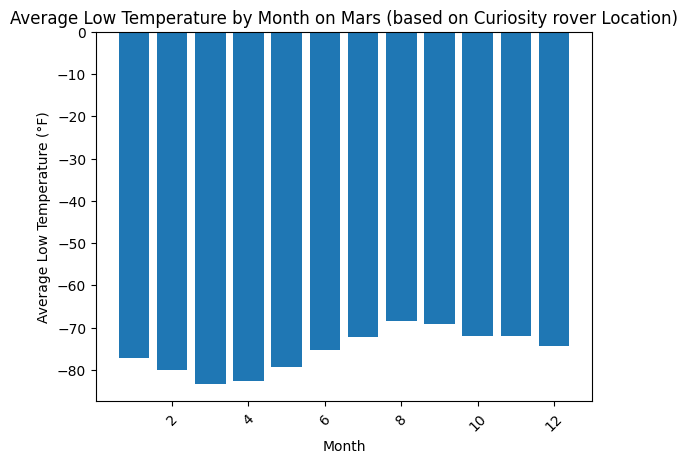
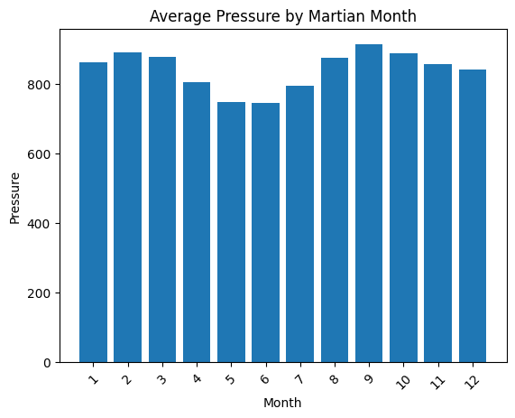
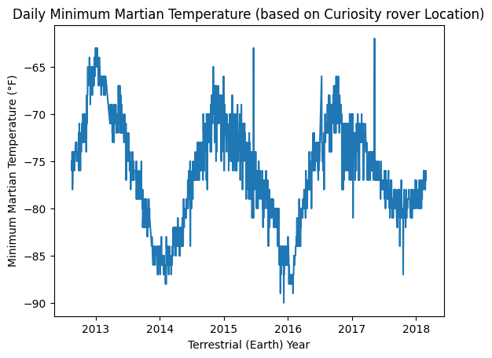
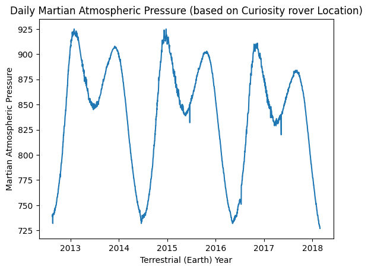

# Module-11 Challenge

###### *Note: The original starter notebooks indicated this was Module 12, which I corrected in the included notebooks because this is Module 11.

### Mars News Scraper

This notebook uses Splinter and BeautifulSoup to scrape the [Mars News](https://static.bc-edx.com/data/web/mars_news/index.html) site for titles and text of news articles, and stores the results.

#### Requirements

* Python
* Splinter
* BeautifulSoup
* JSON

#### Usage

Run part_1_mars_news.ipynb, which will open the [Mars News](https://static.bc-edx.com/data/web/mars_news/index.html) site, scrape the website, and store the titles and preview text of news articles. You'll then be able to view the results stored in the mars_news_dictionary. Additionally, the information is exported to a JSON file (mars_news_dictionary.json) where the data can also be viewed, which eases the sharing with others.

### Mars Weather Data Scraper

This notebook uses Splinter and BeautifulSoup to scrape the [Mars Temperature Data](https://static.bc-edx.com/data/web/mars_facts/temperature.html) site to collect the weather information. It then analyzes the data.

#### Requirements

* Python
* Splinter
* BeautifulSoup
* MatPlotLib
* Pandas
* Numpy

#### Usage

Run part_2_mars_news.ipynb, which will open the [Mars Temperature Data](https://static.bc-edx.com/data/web/mars_facts/temperature.html) site, scrape the website, and store data to then be analyzed. The script will output answers to 5 questions:

1. How many months exist on Mars?

   * There are 12 months on Mars.
2. How many Martian (and not Earth) days worth of data exist in the scraped dataset?

   * There are 1867 Martian days worth of data in the scraped dataset.
3. What are the coldest and the warmest months on Mars (at the location of Curiosity)?

   * The coldest month in Curiosity's location is Month 3 with an average low temperature of -83.31°F.
   * The hottest month in Curiosity's location is Month 8 with an average low temperature of -68.38°F.
     
4. Which months have the lowest and the highest atmospheric pressure on Mars?

   * The month with the lowest atmospheric pressure is Month 6 with an average atmospheric pressure of 745.05
   * The month with the highest atmospheric pressure is Month 9 with an average atmospheric pressure of 913.31

     
5. About how many terrestrial (Earth) days exist in a Martian year?

   * There are about 679 terrestrial (Earth) days in a Martian year.

     *This estimation is arrived at by averaging the length of terrestrial days between the dips and peaks in highest and lowest temperature and greatest and lowest atmospheric pressure. It is admittedly rudimentary, making some assumptions, and based on a limited dataset. It is also incorrect, according to [NASA](https://mars.nasa.gov/resources/21392/mars-in-a-minute-how-long-is-a-year-on-mars/), there are actually 687 Earth days in a Mars year.

     

The mars_weather_df DataFrame is then saved as a CSV before the browser is closed.
